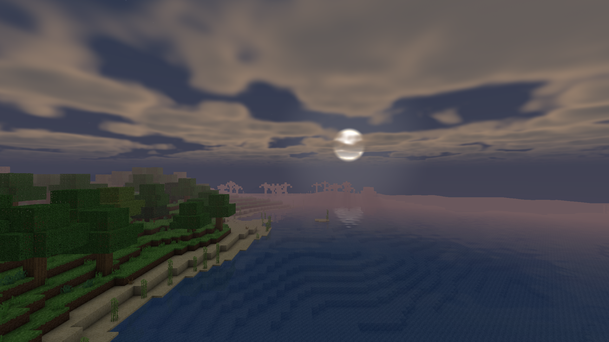
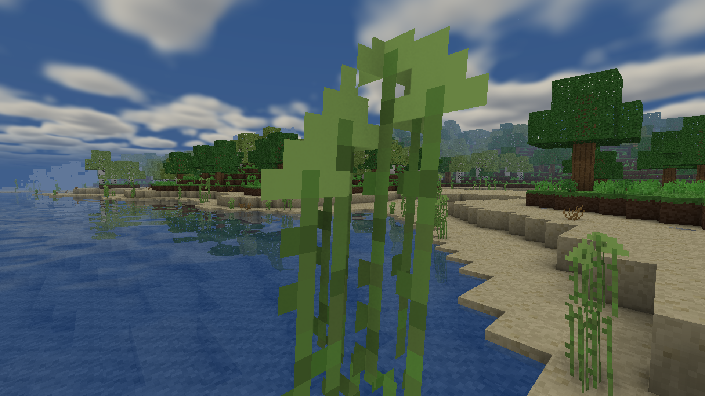
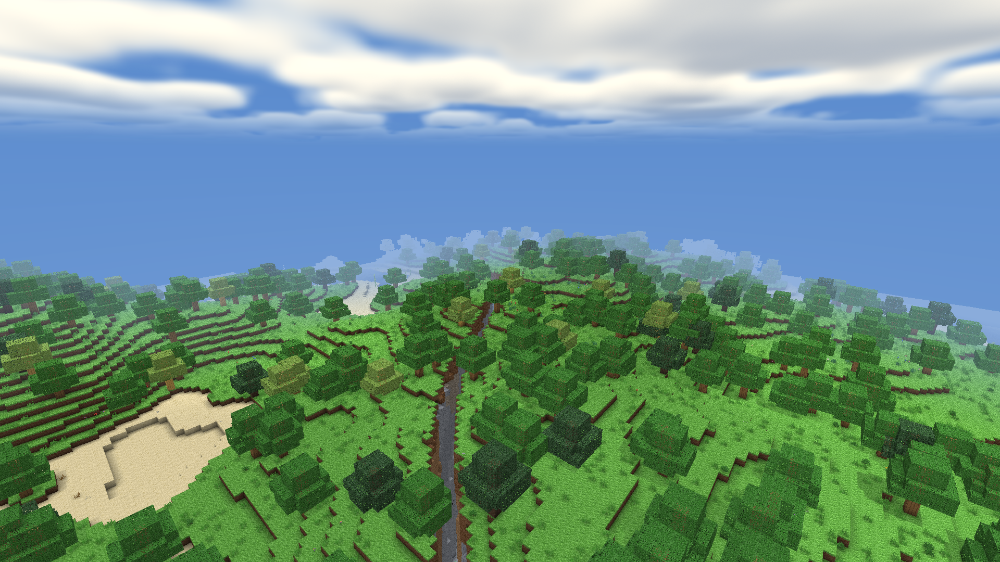
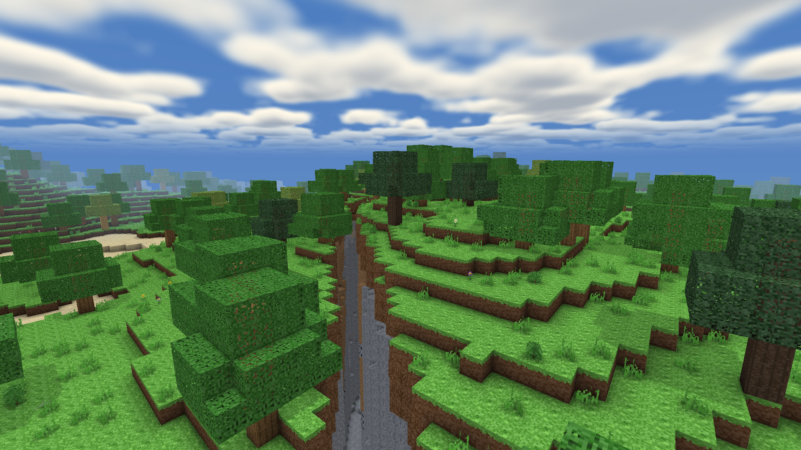
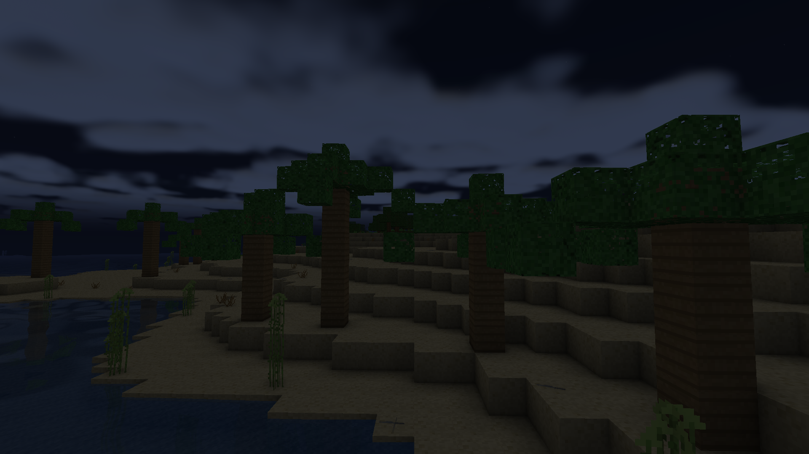
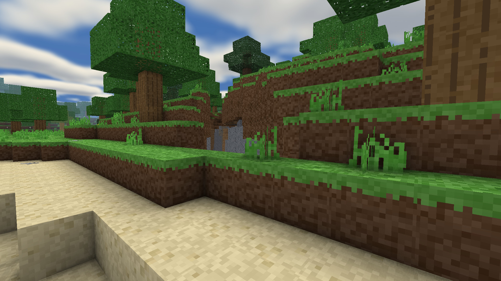
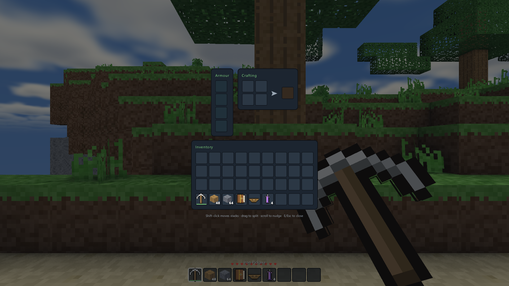
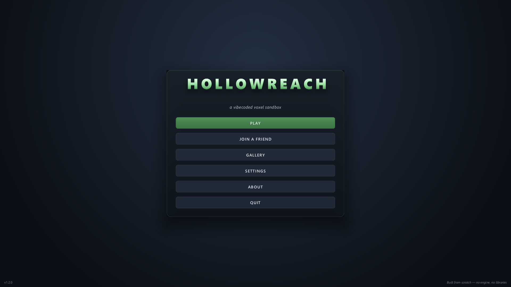

> [!NOTE]
> - This project was built with 99% AI assistance (Claude Opus & Fable) under human oversight. 🤖
> - Expect there to be bugs and balancing issues

# Hollowreach — a vibecoded voxel sandbox

A 3D first-person Minecraft-like, built from scratch in C++: its **own OpenGL
voxel engine, procedural world with real biomes, procedural textures and item
models, deferred lighting pipeline, synthesised sound engine, mob AI, an
in-game world atlas, and host-authoritative multiplayer**. Mine, smelt, craft,
tier up tools/armour, build, chart the map, survive the night, and play with a
friend over the LAN, all in **persistent, shareable worlds**.

It is a native application: one executable, no runtime, no installer, and
nothing that phones home.

> [!NOTE]
> **This repository is a fork.** Hollowreach began life as a dependency-free
> WebGL2 game in ~18k lines of ES modules, and this is a full C++ port of it —
> the same renderer, the same world generator, the same gameplay constants,
> rewritten. The original is archived at
> [Anonymous-Floof/Hollow-Reach](https://github.com/Anonymous-Floof/Hollow-Reach)
> and its history is the first seventeen commits here. The port was verified
> *against* that code through 2.4.0, value by value. From 2.5.0
> `tools/compare_golden.py` diffs 614 generated values against the previous
> **release** instead: the fork has diverged on purpose, and anchoring to the
> browser build had started costing coverage rather than buying confidence — it
> could not check the generator version anyone actually plays.

<table>
<tr>
<td width="50%"><br><sub>Dawn over the sea — the sun low through layered cloud, with the morning fog that burns off as it climbs.</sub></td>
<td width="50%"><br><sub>Real-time water reflections mirror the shoreline, the papyrus and the sky.</sub></td>
</tr>
<tr>
<td><br><sub>Biomes run to the horizon: forest, meadow, beach and a ravine cutting through.</sub></td>
<td><br><sub>Ravines crack the surface open — and volumetric clouds cast moving shadows on the ground.</sub></td>
</tr>
<tr>
<td><br><sub>Moonlight over a palm shore, with drifting cloud and a sky full of stars.</sub></td>
<td><br><sub>A cave mouth in the hillside. They widen into proper caverns the deeper you go.</sub></td>
</tr>
<tr>
<td><br><sub>Every icon and held model is generated at runtime — no image files ship with the game.</sub></td>
<td><br><sub>The interface is its own 2D layer: no toolkit, no dependency, drawn in one batched pass.</sub></td>
</tr>
</table>

## Contents

- [Running it](#running-it)
  - [Updating](#updating)
  - [Building it](#building-it)
- [Controls](#controls)
- [The gameplay loop](#the-gameplay-loop)
- [Farming and cooking](#farming-and-cooking)
- [Dyeing](#dyeing)
- [Multiplayer](#multiplayer)
  - [Playing with friends over the internet](#playing-with-friends-over-the-internet)
  - [Chat and commands](#chat-and-commands)
    - [Who may run what](#who-may-run-what)
    - [The access list](#the-access-list)
    - [Where a command runs](#where-a-command-runs)
- [Architecture (built to be extended)](#architecture-built-to-be-extended)
  - [Common extension points](#common-extension-points)
  - [Resource packs](#resource-packs)
    - [The interface](#the-interface)
    - [Textures](#textures)
- [Deliberately deferred (foundation already in place)](#deliberately-deferred-foundation-already-in-place)
  - [What the port does not carry over](#what-the-port-does-not-carry-over)

## Running it

Download a release, unzip it anywhere, and run **`Hollowreach.exe`**. There is
nothing to install: the assets are baked into the executable and everything
links statically apart from your graphics driver. The game creates a `data/`
folder beside itself on first run and keeps your worlds, screenshots, exports
and settings there, so the whole thing stays portable — move the folder to a
USB stick and it moves with you.

Requirements: a GPU and driver supporting **OpenGL 3.3** (anything from about
2010 onward). Nothing else.

### Updating

**Check for Updates** on the main menu fetches the latest public release and
installs it over your copy. It takes three clicks and never fewer: the first
asks GitHub what the latest version is, the second downloads it, the third
installs and restarts the game. Nothing happens on its own — the game does not
check on startup, does not check in the background, and does not install
anything you have not seen the version number of first.

It only ever adds and overwrites the files that were in the release zip. Your
worlds, screenshots, settings, your own resource packs, and anything else you
have put beside the executable are left exactly as they were — not by an
exclusion list that somebody has to remember to update, but because nothing in
the process deletes anything.

The one thing in `data/` that the zip does carry, and therefore does refresh, is
the bundled example pack at `data/resourcepacks/FilmCowSFX`. If you have edited
it, copy it to a folder of your own name first.

Windows only for now, since the release zip is per-platform and so is replacing
a running executable; the button is not shown elsewhere. There is also
`--check-update` if you would rather ask from a terminal.

### Building it

One command, from a clean checkout, with no environment set up by hand:

- **Windows** — **`build.bat`** finds Visual Studio through `vswhere`, sets up
  the MSVC environment, and uses the CMake and Ninja that ship inside VS. You
  need **Visual Studio 2022** with the C++ workload; you do not need CMake or
  Ninja on `PATH`.
- **Linux / macOS** — **`./build.sh`**, with CMake ≥ 3.21, Ninja and a C++20
  compiler.

The build fetches GLFW and ENet itself; everything else is vendored in
`third_party/`. The result is `build/RelWithDebInfo/bin/Hollowreach`.

If you are going to commit, turn on the repository's hook once:

```bash
git config core.hooksPath .githooks
```

It refuses a commit that would put your machine into the repository — a build
artefact, or a file containing your home directory or account name. Both times
that has happened here it came from `git add -A` straight after running a tool
that had quietly written something, and one of them was a compiled `.pyc` with
an absolute path inside it that nobody would have thought to open.

`Hollowreach --help` lists the harness flags the port was verified with —
`--screenshot`, `--at`, `--time`, `--seed`, `--screen`, `--threads`,
`--selftest` and the rest. `--selftest` runs 1380 assertions with no window at
all and is the fastest way to know a change did not break something.

## Controls

| | |
|---|---|
| Move | WASD |
| Look | Mouse |
| Jump / swim up | Space |
| Sprint (1.3×) | Hold Left Ctrl while moving |
| Fly (toggle, creative worlds) | Double-tap Space |
| Crouch (slower, and will not walk off a ledge) | Left Shift |
| Break block / attack | Left mouse (hold) |
| Place / use station / open door / sleep / **eat** | Right mouse |
| Pick block (bring one you own to hand) | Middle mouse |
| Choose a painting's picture | Right mouse on a hung painting |
| Drop item | Q (one) · Ctrl+Q (whole stack) · hold Q to keep dropping, faster the longer you hold |
| Climb ladder | Walk into it + W/Space (Shift = down) |
| Select hotbar | 1–9 / scroll |
| Inventory | E |
| Move a slot to the hotbar | Hover it and press 1–9 (swaps) |
| Move many at once | Hold Shift and drag across slots |
| Drop from a slot | Q over it (one) · Shift+Q (whole stack) · hold, or drag across slots |
| Recipe book | H (or the **Recipes** button on any crafting screen) |
| Chat | T |
| Command | `/` (opens chat with the slash already typed) |
| Complete the word you are typing | Tab, or ↑/↓ to pick from the list |
| Recall something you sent | ↑/↓ when nothing is being suggested |
| Select text in the chat log | Click and drag across it |
| Copy · paste · cut | Ctrl+C · Ctrl+V · Ctrl+X |
| Atlas map (needs an **Atlas**) | M |
| Screenshot | F2 |
| Hide the interface | F1 |
| Fullscreen | Alt+Enter |
| Pause | Esc |
| Debug overlay | F3 |

**Settings** (pause or main menu) come in two kinds, and the tabs say which.

**Yours, and they follow you between worlds** — *Graphics* (render distance and
quality preset, shadow/reflection/cloud/AO toggles, render resolution,
fullscreen, borderless window, V-Sync, a frame rate cap), *Controls* (mouse
sensitivity, raw input, invert, interface scale), *Gameplay* (High Step, minimap,
death waypoints) and *Audio*. These live in `data/settings.json`.

**The world's, and they stay with it** — *Difficulty* (fall damage, hunger,
monster spawning) and *Cheats*, which in a survival world is empty and does not
appear at all: flight, no-clip, invulnerability and instant break belong to
creative worlds. These are saved inside the world, travel
with it when you share it, and only appear while a world is open: on the main
menu there is no world whose rules could be shown. **In multiplayer they are the
host's** — a guest can read them but not change them, because a rule only half
the room agreed on is not a rule, and the host's choices are pushed to everyone
the moment they change.

Every setting applies live, with no restart. The in-game **About** screen (main
menu) has a quick feature rundown if you want the highlight reel instead of
reading this whole file, and **Quit** is at the bottom of that same menu — it
saves the open world on the way out.

**Screenshots (F2):** captures land in an in-game gallery (Gallery button on
the main or pause menu) where you can view them, delete them, or reveal them in
your file manager. They are ordinary PNGs in `data/screenshots/`.

**Performance.** Milliseconds per frame at 1920×1080 on a Radeon RX 5700 XT:

| Render distance | Low | High | Ultra |
|---|---|---|---|
| 4  | 0.67 (1490 fps) | 1.61 (621 fps) | 2.05 (487 fps) |
| 8  | 0.93 (1077 fps) | 1.88 (532 fps) | 2.32 (432 fps) |
| 12 | 0.68 (1481 fps) | 2.38 (420 fps) | 2.81 (356 fps) |

The Low row does not order by distance, and that is not a misprint: under a
millisecond the frame is no longer bound by how much world is in it, so the three
cells are measuring the overhead around the render rather than the render.

Every cell comes from one command, so you can reproduce or dispute it:

```
Hollowreach --world --seed 3918175327 --at 0,0,0,0,0 --freeze --time 0.5 \
  --quality ultra --render-distance 12 --no-vsync --perf --frames 2500
```

A fixed camera and a pinned midday sun, because both matter more than the
settings do — how much sky is on screen sets what the cloud march costs, and
that pass is about half the frame. An earlier version of this table quoted
numbers a third lower with no camera attached to them, which made it impossible
to tell a real change from a different place to stand.

**These numbers are only comparable to each other.** Repeated runs in one sitting
settle within about 5%, but the same binary measured on different days moves far
more than that — this table's predecessor read 4.71 ms for the bottom-right cell,
and the *identical shipped executable* re-measured 2.91 ms in the session that
produced the table above. Nothing about the build changed; the machine was in a
different state. So a number here is evidence about this machine on one afternoon
and nothing else.

The consequence is worth stating plainly, because it is easy to get wrong: you
cannot compare a release against a number written down for an earlier one. To ask
whether a change cost anything, run both binaries back to back **interleaved** in
the same sitting. That was done for 2.4.0 against 2.3.0 — 2.77 vs 2.75 at
Ultra/12, 2.02 vs 2.00 at Ultra/4 — and again for 2.5.0 against 2.4.0, whose GPU
passes paired at 5.30 vs 5.31 and 5.18 vs 5.19 on a different afternoon. Note
that those absolutes are nothing like the table's: same binaries, different
camera and a machine in a different state, which is the whole point. The renderer
is unchanged in both cases; what 2.5.0 moved is CPU-side and shows up in
`streaming on the main thread`, not here.

Two traps found the hard way while measuring that, both of which produce
confident-looking numbers that mean nothing:

- **Sweeping the grid inflates the later cells.** Running all nine in sequence
  reads about 1.6× the interleaved pairing by the end — the GPU clocks down as
  the run goes on, so cell nine is measured on a hotter machine than cell one.
  Pair each cell against its counterpart instead of sweeping and then comparing
  two sweeps.
- **An old binary unzipped somewhere else brings its own `data/` with it**, and
  therefore its own resolution and its own world. That silently makes it a
  1280×720 comparison against a 1920×1080 one, which roughly doubles every GPU
  pass and looks exactly like a catastrophic regression in the new build. Point
  both at the same data directory, or check the reported resolution before
  believing anything.
- **Never time a vsync-bound run.** Wall clock over `--frames N` without
  `--no-vsync` measures the display's refresh rate and nothing else: three builds
  with visibly different amounts of CPU work all took 3.9–4.0 s for the same 400
  frames. This one cost a wrong figure in `docs/ROADMAP.md` for a day. For chunk
  work read the `streaming on the main thread` line under `--perf`, which is the
  main thread's own share and is what actually changes.

Neither lever costs much. Render distance is nearly free past 8,
because fog bounds what is actually visible long before the loaded radius does,
and the whole spread from Low to Ultra at distance 12 is about 2.1 ms. If you do
need to claw some back, **Render Resolution** is the biggest single control —
it draws the world at a fraction of the window and scales it up, leaving the
interface sharp — and turning individual effects off (God Rays, Water
Reflections, Cast Shadows, Volumetric Clouds) removes a whole pass each.

If you want to know where a frame actually goes, `--perf` prints a per-pass GPU
and CPU breakdown while you play and a summary when you quit.

**Bed** — craft from 3 planks + 3 wool (from a sheep), place it (it lays out two cells, pillow
always at the head whichever way you face), then right-click it to open the
**Time Wheel**: a 24-hour dial, painted with the day it describes, showing the
hour it is now. Closing it again costs nothing, which makes a bed the closest
thing to a clock in the game. Drag the handle to the hour you want to wake at and
confirm, and you sleep until then — a nap through the worst of a night is a
different decision from sleeping the whole of it. You can only sleep **8 game
hours after the last time you did**; until then the wheel tells you how long is
left. Sleeping advances the actual game clock, so
time-of-day mechanics (like grass spreading) move forward while you sleep. **Boat** —
craft from 5 planks, right-click to set it on water (or ground); right-click it
to ride (look where you want to go, W/S throttle, A/D strafe), **Shift** to
dismount, and left-click an empty boat to pick it back up.

**Painting** — craft from 7 planks around 1 wool and 1 azurite, hang it on any
wall, then right-click it and choose one of your own screenshots to display.
The picture is stored *in the painting*, not as a link to the file: it survives
deleting the screenshot, it travels with an exported world, and a friend who
joins your game sees what you hung even though they have never seen your
captures folder. It is scaled to 128 square on the way in, which is 48 KB per
painting and sharper than anything else in the world.

**Inventory (Mouse-Tweaks style):** Left-click picks up / places a stack,
right-click takes half / places one. **Shift-click** instantly moves a stack to
the other container (inventory ↔ chest/forge, hotbar ↔ storage) — and **hold
shift and drag** across slots to move every one you touch, which empties a
rucksack into a chest in a single gesture. **Q** over a slot throws that stack on
the floor, and **holding Q while dragging** throws all of them. Hold **left** and
drag across slots to split a held stack evenly; hold **right** and drag to drop
one per slot. **Scroll** on a slot to nudge single items across. Hover any item
for its name and stats.

**Biomes:** the overworld is split by temperature and moisture into
**meadows**, dense **forests**, pale **birch groves**, sandy **deserts** and
**snowfields**, with **palm trees** on warm beaches and **papyrus** reeds
growing along shorelines. Mountain ranges rise well above the old hills,
**ravines** crack the surface open, caves widen into proper caverns the deeper
you go, and the deepest passages are **flooded** — bring a way back up.

**Buckets & water:** craft a **bucket** from three iron ingots, right-click
still water to scoop a source, and right-click again to pour it back out
anywhere — the placed water flows for real, so you can move springs, fill
moats, or carve waterfalls. An empty bucket used on a **cow** fills with milk.

**The Atlas:** craft it from **3 paper + 1 leather + 1 azurite** (paper comes
from shoreline **papyrus**) and carry it to unlock cartography. **M** opens a
fullscreen top-down map — every block is one pixel in its true colour, with
relief shading and depth-tinted water — that only charts ground you've
actually explored (the rest stays fogged). Click to drop **waypoints** (rename,
recolour or delete them in the side panel); they show as floating markers in
the world with live distances. Dying pins an automatic **death waypoint** where
you fell (toggle in Settings), and a corner **minimap** (toggle in Settings)
keeps your surroundings and waypoint headings in view. Lose the Atlas — say, by
dying with it — and the map goes with it until you get it back.

**Soul Anchor & Wayshard:** the **Soul Anchor** — one of every ore ringing a
sparkstone — is a placeable block; right-click it to attune your **spawn
point**, and you'll wake there when you die (breaking it unbinds you). The
**Wayshard** (gloamite + sparkstone) is a one-use escape rope: use it deep
underground and it warps you straight up to the surface. Two new deep ores
power them: violet, faintly glowing **Gloamite** and mossy **Verdanite**.

In water you swim: you sink slowly, hold **Space** to rise (and swim into a
shore to climb out), or **Left Shift** to dive. Soft blocks (grass, dirt, wood,
sand) drop when mined by hand — only stone, ores and other hard blocks require
the right tool tier — and a tool only mines faster for the block class it's
*meant* for. Chop all of a tree's logs and its leaves decay on their own.
**Grass creeps**: exposed dirt that's lit and next to grass slowly turns to
grass over in-game days (so a dug-out patch heals over, and beds let you watch it).

**Animals:** wild **sheep**, **pigs** and **cows** wander the grass in
daylight. Left-click to attack (a sword hits hardest, and striking **while
falling lands a critical hit** for 1.5× damage). A sheep drops a block of
**white wool** (which, with planks, crafts a **bed**); a pig drops a **Raw
Porkchop**; a cow drops **Raw Beef** and sometimes **Leather** — cook the meats
on a **Stove** (the forge smelts ore, not dinner), and right-click a cow with an
empty bucket to **milk** it, which is the only source of dairy in the game. All of them climb hills and steer clear of water, so they stay
on dry land instead of drowning.

**Monsters:** **zombies** rise wherever it is pitch dark — light level zero, and
nothing else. On open ground that means after nightfall, as it always did. In a
cave, a mineshaft or any room you have roofed over it means *at any hour*, so
digging without a torch in your hand is now its own decision. Lighting a space
is what stops them, exactly as you'd expect: a torch has a radius, and inside it
nothing spawns. They need genuine line of sight to notice you — no seeing through
walls — and once they spot you they path around obstacles to reach you,
remembering roughly where you last were for a few seconds if you break their
sight, clawing for damage when they close in (armour softens the blow). They burn
away in direct sunlight, so one that follows you out of a cave at noon does not
last long. A slain zombie drops **rotten flesh** (edible, but a gamble — it might
feed you a point or sicken you for two). Like the animals they climb 1-block
ledges and won't wade into the sea. One that has got a long way from you is
removed rather than left standing in the dark forever. (Turn them off in
Settings.)

**Evil Altar:** a dark, caged block with something burning inside it that breeds
zombies around itself while you are near, in daylight as readily as at night. It
answers to the same rule as everything else — light the room and it goes quiet —
so a torch is the way to disarm one you would rather keep. There is **no recipe**
for it and mining it destroys it: it is here for the dungeons it will be placed
in, and for now `--give evil_altar` is the only way to hold one.

**Survival:** a **hunger** bar (next to your hearts) slowly drains as you live and
act — sprinting and swimming burn it faster. Eat to refill it; when it empties you
**starve** and lose health until you eat. You only regenerate health while
well-fed. Hold your breath underwater: a row of **bubbles** counts down once your
head is submerged, and when they run out you start to **drown**. (Hunger can be
toggled off in Settings; breath/drowning is always on.) Taking a hit now also
**wears your armour** — it soaks damage and loses durability for it — and
flashes a **red vignette** around the edge of the screen, so a hit you did not
see coming does not go unnoticed while you are looking somewhere else. Run out
of hearts and you **die**: what you were carrying drops where you fell, a death
waypoint is pinned on the Atlas, and you wake at your Soul Anchor.

**Things hold each other up.** Torches, plants, mushrooms and pebbles need solid
ground beneath them, and break into their drop when it goes — mine the dirt under
a torch and the torch comes with it. **Sand falls**: dig it out from underneath
and it drops as a real falling block, stacking up wherever it lands, which is
what makes a dune collapse when you tunnel through it. And water **washes away**
what it flows into: a flooded torch or tuft of grass is gone, though water
sitting quietly beside a shoreline leaves it alone. All of it is event-driven —
nothing is checked until something near it changes — so a world holding tens of
thousands of plants costs nothing until you disturb one.

**Atmosphere:** the world breathes a little. A real **sun** and **moon** arc
across the sky (the sun rises in the east), the night fills with a sparse,
twinkling **star field**, **volumetric clouds** drift overhead and cast moving
shadows on the ground, and **dawn rolls in thick fog** that burns off as the
morning brightens. The sun **casts real shadows**, **water reflects** its
surroundings and gives a soft underwater view when you're submerged, and
ambient occlusion + god-rays add depth in caves and under canopies (all
toggleable in Settings if you'd rather have the frame rate back). **Leaves
sway** and the **water surface ripples** with a gentle noisy motion, the camera
does a soft **head-bob** as you walk (more when you sprint) with your held item
swaying along, and mobs — and other players, in multiplayer — walk with real
**limb animation** instead of sliding. All of it is driven on the GPU so it
costs almost nothing.

**Building blocks:** **stairs**, **slabs** and **vertical slabs** can be cut
from *any* wood, sandstone or stone — including the polished and brick
sub-variants — so every material has a matching step and half-block. Stairs and
slabs read where you aim: click a block's top for a bottom slab / right-way-up
stair, its underside (or the upper half of a side) for a **top slab / upside-down
stair**. A slab crafts into a **vertical slab** (and back) for thin walls. Each
**wood type makes its own doors, trapdoors, stairs and slabs**, and any wood's
planks work for sticks, the workbench, chests, beds and boats (even mixed).
Ladders, trapdoors and doors place facing you; doors and trapdoors toggle on
right-click (and politely refuse to close on anyone standing in the frame).
Beyond Stone and Oak there are two more stone families (**Umberstone**,
**Slatestone**, each with polished + brick forms) and four more woods
(**Pine**, **Walnut**, **Birch**, **Palm**) that generate naturally — stone in
underground blobs, the woods as their own trees in their own biomes. **Torches** angle correctly when set on a
wall, and show as a flat sprite in hand and when dropped. **Chests** store 27
stacks; **forges keep smelting with the UI closed** and both keep their contents
until you mine them. Out of Coal? **Smelt logs into Charcoal** — it burns and
crafts torches just like Coal. **Anything wooden burns as forge fuel** — logs,
planks (any wood type), wooden tools, chests, boats, even torches — and the burn
time is read straight from the item's recipe, so it scales with how much wood
went in (no per-item bookkeeping).

**Recipe book (press H):** categorised tabs (Building / Tools / Armour /
Materials / Smelting), a fuzzy **search** box, and grouped cards — near-identical
recipes (every stairs material, every pickaxe tier, a torch's two fuels) collapse
into one card you cycle with the **‹ ›** arrows. Hover any ingredient or result
for the same detailed tooltip the inventory shows (tool tier, mining speed,
durability, armour defense, fuel time).

**Click a recipe** and it lays itself out in the crafting grid you opened the
book from, taking the ingredients out of your bag — so you never have to
remember a shape. It is all or nothing: if you are short of something the grid
is left exactly as it was, rather than half-filled and looking ready. A tag
ingredient ("any planks") picks the wood you have *least* of, which spends the
odd single birch plank before it opens the stack of sixty oak. Clicking a second
recipe returns the first to your bag rather than refusing, and the variant on
show is the one you get — so cycle to the tier or the wood you want first.

## The gameplay loop

1. Punch **Oak** trees → logs → **planks** → **sticks** → a **Workbench**.
2. Mine stone with a wood pick for **Cobblestone** → build a **Forge**.
3. Mine ores; smelt **Raw Copper / Iron / Gold** into ingots at the Forge
   (fuel: Coal, logs, planks).
4. Climb tool & armour tiers: Wooden → Stone → Copper → Iron → Gold (fast,
   fragile) → **Diamond**. Each tier unlocks the next ore (e.g. only an Iron+
   pick harvests Diamond).
5. Craft **Torches** to light caves; build with planks, bricks, polished stone,
   sandstone and glass.
6. Gather papyrus and leather for an **Atlas**, mine every ore for a **Soul
   Anchor** to move your spawn, and keep a **Wayshard** in your pocket for the
   trip back up.
7. **Eat properly.** Find wild crops, till soil with a **hoe** and plant the crop
   itself — there are no seed items, so a carrot both feeds you and sows the next
   one. Farmland within four blocks of water grows about twice as fast.
8. Build a **Cutting Board**, a **Stove** and a **Cooking Pot**, and cook. A single
   cooked chop is what you eat when you have failed to make a meal; a stew is worth
   several of them and lasts far longer. Better ingredients turn the same pot recipe
   into a better dish.
9. Keep a **varied diet** — grain, vegetable, fruit, protein, dairy — for up to
   three extra hearts. Living on one crop earns none of them.

Worlds are saved as `.hrw` files in **`data/worlds/`** beside the executable —
a compact binary format: a checksummed header over a list of tag-dispatched
sections, so a new section costs no version bump and an unknown one is skipped
rather than fatal. Writes are atomic (written to a temporary file and renamed),
so losing power mid-save costs the save and not the world. A truncated, corrupt
or hostile file is rejected with a reason instead of loading as nonsense, and
`Hollowreach --save-info <id>` will tell you which reason.

There is an autosave every fifteen minutes and another on a clean shutdown, so
closing the window does not cost you the session. To share a world, **Pause →
Export World** writes it to `data/exports/`, and the world-select screen imports
anything sitting in that same folder — one folder is both outbox and inbox,
which is a smaller cost than a native file dialog for two buttons.
`--export-world` and `--import-world` take real paths for anything scripted.

## Farming and cooking

**Eighteen crops** grow wild across the world, and where you find them depends on
where you are: wheat, barley and maize in meadows; potatoes, garlic and soybeans
in forest; cabbage and blueberries in the cold; melon and chili in desert; rice
in the wettest ground anywhere. Travelling is how you widen a diet.

**The produce is the seed.** Till soil with a **hoe** and right-click it with a
carrot to plant a carrot — there are no separate seed items, so nothing doubles
up in your bag or in the recipe list. Shake **Wild Seeds** out of tall grass if
you have not found a patch yet. Crops grow through four visible stages and pay
out several times over when ripe; pull one early and you get your seed back and
nothing else. The debug overlay (**F3**) names the crop and stage you are looking
at.

**Ground is worth improving, and shows it.** A crop takes about **half an hour**
on plain dry soil. Tilled ground within four blocks of water grows it **twice as
fast**, **Fertiliser** (verdanite composted with rotten flesh) does the same
again and adds a 50% chance of an extra item at harvest, and the two stack — so a
watered, fertilised plot is ready in roughly seven minutes. All four states are
visibly different tiles, darkening as the soil improves, so a field can be read
by looking at it.

**Cooking is where the labour pays.** Three stations, all crafted at a workbench:

| | |
|---|---|
| **Cutting Board** | Prep, no fuel. Mills grain into flour; butchers one raw chop into **two** strips, so worked meat goes further. |
| **Stove** | Dry heat, up to three ingredients and fuel — meat, bread, roasts, pies, cheese. Meat is cooked here, not in the forge. |
| **Cooking Pot** | Up to six ingredients, a bowl and fuel, into a real meal. Bowls come back when you eat what was in them. |

**Better ingredients make a better meal from the same recipe** — three plain
vegetables make Vegetable Soup, and the same pot with a chili or some garlic in
it makes Hearty Stew.

**Single foods are the fallback now.** Every food carries its own *saturation* —
how long it actually holds you, shown on its tooltip — instead of the flat value
everything used to share. A cooked meal is worth several times a cooked chop, and
raw produce is worth almost nothing.

**A varied diet is worth extra hearts.** Food belongs to one of five groups —
grain, vegetable, fruit, protein, dairy — and keeping several of them up earns up
to **three extra hearts**. Living on one crop earns none of them, however much of
it you grow. The five levels drain over about a day and are shown on the
inventory screen.

`--find-crop` prints the wild crops near a seed's spawn and points at the densest
patch, the way `--find-dungeon` does for dungeons.

## Dyeing

Eight flowers grow wild, and each one grinds into a dye: **poppy** red, **marigold**
orange, **dandelion** yellow, **fernflower** green, **cornflower** blue, **violet**
purple, **daisy** white and **nightcap** black. One flower makes two dye.

One of every dye crafts the **Dyer's Palette**, which is the whole feature in one
item. Hold it and right-click anywhere — it does not need a block to be pointed at —
and a colour screen opens: a hue ring, a saturation and value field inside it, and a
hex box if you would rather type `#4a6fe0` than hunt for it. The palette never wears
out, and needing one of every dye means needing one of every flower, so it is earned
by having travelled rather than by having found a good meadow.

Put anything dyeable in the slot and pick a colour. **Wool, glass and beds** can be
dyed, and so can **Colourable armour** — craft any piece together with a wool to get
its colourable twin, in every tier. A Colourable Iron Chestplate protects exactly as
well as a plain one; the plain one still looks like iron, which is why the two are
separate items rather than one item with a flag.

**A dye colours sixteen items at a time**, and you are charged whichever of the eight
is nearest the colour you mixed — the screen names it and tells you how many you have
before you commit. A wall in one colour is cheap; a gradient is a project.

Colours can be saved in two places and the difference matters. **Saved in this world**
keeps a swatch in the world file, with that build. **Saved everywhere** keeps it
beside your settings, so it follows you into every world you ever make.

Anything dyed keeps its colour everywhere it goes: in the inventory, as a dropped
item on the ground, in the hand, placed in the world, through a save, and across the
network to everyone else playing.

## Multiplayer

Up to eight people on the same network can play together, over UDP, with no
server to run and nothing to sign up for.

- **Host:** Pause → **Open to LAN**. The button then reads *Stop Hosting* and
  shows an invite code and how many guests are connected.
- **Join:** from the main menu, pick **Join a Friend**. Games on your network
  announce themselves and appear in the list, so usually there is nothing to
  type at all — click one. The field below takes an invite code or a plain
  `address` / `address:port` if you would rather.

The invite code is the same `HRW1…HRW1` envelope the browser build used, so it
still survives being lowercased, broken up by a chat client, or read out loud —
it is Crockford base32, with the letters that look like digits left out.

### Playing with friends over the internet

Everything above is for people on the same network. To play with somebody
somewhere else, your router has to be told to let them in, and Hollowreach can
ask it for you: **Settings → Multiplayer → Open a Port for Internet Play**, then
host as usual. It tries NAT-PMP first and UPnP second, and the panel says which
worked. The invite code then reaches you from anywhere.

> **Read this part before you turn it on.**
>
> While that port is open, **anyone on the internet can send data to the game**,
> not only the people you gave the code to. The internet is scanned continuously
> and automatically; an open UDP port will be found within hours whether or not
> you told anyone about it. That is not a flaw in this implementation — it is
> what a port forward *is*, in every game that offers one.
>
> What that means in practice:
>
> - **Only share the code with people you actually trust.** Not a public Discord,
>   not a stream, not a forum post. Anyone holding it can join your world, and
>   anyone who joins can see your address.
> - **Guests are not sandboxed from your world.** A guest can build, break, and
>   take things from chests. There is no permission system yet.
> - **Turn it off when you are done.** Stopping hosting closes the port again.
> - **Keep the game up to date.** A network-facing program is worth patching;
>   `--check-update` is there for a reason.
>
> The port is opened with a **one-hour lease that the game renews while it runs**,
> so if the game crashes the router drops it by itself within the hour. It is
> also explicitly closed when you stop hosting, leave the world, or quit.

**On hiding your address.** The panel shows the `HRW1…` code rather than a bare
`203.0.113.7`, and that is worth something: your address is not sitting in the
open in a screenshot, over your shoulder, or in a chat log that a bot is
scanning for things shaped like addresses.

**It is not a secret, and it would be wrong to tell you otherwise.** The code is
an *encoding*, not encryption — this game decodes it instantly, and so will any
base32 decoder on the web. Anyone who actually connects to you can read your
address off their own connection list no matter what the code looks like. That
is simply how connecting to a computer works.

If you want your address genuinely hidden, the only thing that does it is
putting a third machine in the middle, which this game has no server for. A
private network overlay like **Tailscale**, **ZeroTier** or **Hamachi** does
exactly that: everyone joins the overlay, the game sees plain LAN addresses, and
no port is opened to the internet at all. If that is an option for you, it is
strictly safer than this feature, and you do not need this feature to use it.

**If your provider uses carrier-grade NAT** — common on mobile broadband and
increasingly on fixed lines — there is no address to share and nothing the game
can do about it. The panel says so plainly rather than handing you an address
that will never answer.

#### If the router will not do it automatically

`--net-doctor` distinguishes the two failures, because they need different
answers:

- *"no UPnP device answered on this network at all"* — nothing here speaks UPnP.
- *"N UPnP device(s) answered, but none of them was a router that forwards
  ports"* — something replied (a television and a printer both will) and your
  router did not. **If its UPnP setting is switched on and you still see this,
  the router is not honouring it.** Worth checking: that the setting was actually
  applied and saved, and that the router's own note about UPnP needing a live WAN
  service with NAT is satisfied — a modem in bridge mode often is not.

Either way, the manual route always works and is not much harder:

1. In the router's admin pages, find **NAT → Virtual Servers** (some call it Port
   Forwarding). Not *Port Triggering*, which reacts to outbound traffic, and
   **not DMZ Host**, which forwards *every* port to one machine and is far more
   exposure than this needs.
2. Add one entry: protocol **UDP**, external and internal port **25565**,
   internal address = the hosting PC's LAN address (`--net-doctor` prints it on
   the `[use ]` line).
3. Host as usual, with the game's port-forward setting **off** — it has nothing
   left to do.
4. Your friends need your public address, which the router's status page shows as
   its WAN or Internet address. The Join box takes `address:port` directly, so
   `203.0.113.7:25565` is all they need.

Everything in the warning above applies just the same to a manual forward — more
so, because a hand-made entry has no lease and stays until you delete it.

**If a world does not appear in the list**, run this on both machines first:

```bash
Hollowreach.exe --net-doctor
```

It prints every network a game here would be announced on (and which ones are
skipped, and why), whether the two UDP ports are free, whether the machine can
hear its own announcement, the protocol version — **two different builds cannot
see each other and say nothing about it** — and the full path of the running
executable, which is what Windows firewall rules are keyed on. It exits non-zero
if it finds something that would stop the machine being found.

There are only really two causes, and the first is not the game:

- **The firewall has not been asked.** Windows drops unsolicited inbound UDP for
  a program with no rule, while still allowing the outbound connection a typed-in
  address makes — which is exactly why typing the address can work when the list
  stays empty. Allow Hollowreach through Windows Defender Firewall for **Private**
  networks on the *hosting* machine. If the network is classified Public, either
  change it to Private or expect discovery not to work.
- **The beacon left by the wrong network card.** A machine with Hyper-V, WSL,
  VirtualBox or a VPN has several, and a broadcast only goes out one of them.
  Hollowreach now beacons on every interface it finds and guests actively ask as
  well as listen, which is what this used to get wrong; run with `--verbose` and
  the log names every network it is using, so you can see whether the one you
  expect is there.

Failing both, the address field always works: the host's Open to LAN panel shows
the address to type.

**Known limit:** this is LAN-first. The browser build got NAT traversal for free
from WebRTC; UDP does not, so playing with someone outside your network needs a
forwarded port (default **25565/udp**) on the host's router. The transport layer
has an explicit seam for a relay or hole-punch backend if that ever changes.

The host's world is authoritative — they simulate mobs, water, forges and
time; guests generate the same terrain locally from the shared seed and stay
in sync via live edits and periodic snapshots. Your own movement, mining,
building, crafting and inventory apply instantly on your end regardless of
ping; only seeing *someone else's* edits, combat, and container access wait on
the connection, so play stays responsive even at high latency. Guests can do
everything the host can: place, ride and break **boats** (riding is predicted
client-side, so it feels instant), **milk cows**, use **Wayshards**, land
falling **critical hits**, and attune a **Soul Anchor** — a guest's spawn
point, inventory and position are all saved inside the host's world and
restored if they reconnect.

**Nothing pauses in a shared world.** Opening the inventory, the map or the pause
menu stops the game when you are on your own, because on your own the game is
waiting for you. With other people in it, it is not yours to stop: mobs keep
moving, dropped items keep falling, forges keep smelting, the sun keeps setting,
and your own body keeps standing there — falling, drowning and taking hits —
while you read a menu. Every other player also appears on the **Atlas** and the
minimap as a coloured arrow pointing the way they are facing.

**Sleeping together** works like a proposal rather than a poll. Whoever opens a
bed first picks the hour, and only *they* have to be tired enough to sleep;
everyone else's bed then shows their name and their hour, and all it asks is
whether you agree. The night moves once everyone has. That way a group is never
held awake because one of them happened to nap more recently than the rest — and
because the host owns the clock, it is the host that sweeps it and tells everyone,
rather than each client fast-forwarding its own copy and drifting apart doing it.

While connected as a guest, the world-list
"Export World" button becomes **Leave World** instead, since it's the host's
save, not yours.

### Chat and commands

**T** opens the chat box; **`/`** opens it with a slash already typed. It draws
over a live world and does not pause it — the reason you are typing is usually
something you are looking at, and a command whose effect you cannot watch happen
is one you have to run twice to believe.

Commands work in single player too, where you are the owner of your own world.

**Nobody has to remember a key.** Start typing and a list appears above the box,
matched fuzzily rather than by prefix: `sto` finds `greystone`, `rd` finds
`renderDistance`, `pkst` finds `pick_stone`. **↑/↓** move through it, **Tab**
takes the highlighted one, **Enter** sends. Nothing is highlighted until you
press ↓, so Enter on a command you already know sends it rather than replacing
your last word with somebody else's. With no list up, ↑/↓ walk back through what
you have already sent.

Arguments complete from whatever they actually accept — a player argument offers
whoever is in the world, an item argument the item registry, `/set` the settings
schema, and the value after `/set` whatever *that* setting takes.

**The log is text, and behaves like text.** Drag across it to select, **Ctrl+C**
to copy — a seed, a coordinate, something somebody said. **Ctrl+V** pastes into
the box and **Ctrl+X** cuts, so a seed copied out of one world can be typed
straight into another. Clicking in the box puts the caret where you clicked.

#### Who may run what

Four levels. The host of a world always holds **owner**; everyone else starts at
**anyone** and is promoted with `/op`.

| | |
|---|---|
| **anyone** | affects only you, or only reads: `/help` `/list` `/me` `/msg` `/seed` `/kill` (yourself), `/set` (your own preferences) |
| **trusted** | bends the world's rules for yourself: `/tp` `/spawn` `/locate` |
| **operator** | the world's rules and other people's bodies: `/give` `/clear` `/heal` `/kill` (others) `/summon` `/time` `/gamemode` `/say` `/kick` `/save` `/perms` `/op` `/deop`, and `/set` on anything world-scoped |
| **owner** | who may be here at all: `/ban` `/pardon` `/banlist` `/whitelist` `/stop` |

Two rules hold it together:

- **You may grant at most your own level.** An operator can vouch for a newcomer
  up to operator and no further, so a host can delegate looking after a world
  without handing it over. Only an owner can mint another owner.
- **You may only act on somebody strictly below you.** Two operators able to kick
  or demote each other is how a disagreement becomes a kicking match; the point of
  having an owner is that there is somebody to settle it. Acting on *yourself* is
  always allowed — standing down takes nothing from anybody else.

`/set` is the interesting one: it is filed under **anyone** because your own
field of view is your own business, and it refuses at **operator** the moment the
setting turns out to be one of the world's rules. Anything the settings screen
would not let you change, it will not either — including the rule that a world
created Survival can never become Creative, which lives in exactly one place and
is not restated here.

#### The access list

Who is trusted, banned or whitelisted lives in **`data/access.json`**, beside
`settings.json` rather than inside a world. Being an operator is a fact about a
*person*, not about a place: a host who ops a friend, makes a new world an hour
later and finds them demoted has been told something false about what opping
meant. It is also exactly the file a dedicated server will read.

One row per person, hand-editable:

```json
{
  "whitelist": false,
  "players": [
    {"id": "k3f9...", "name": "Ada", "level": "operator"},
    {"name": "Mallory", "banned": true, "reason": "griefing"}
  ]
}
```

A ban is typed against a *name*, because a name is what you know. The id is
recorded the first time that name connects, and from then on the ban follows them
across a rename. `"whitelist": true` refuses everybody not named — operators
included by virtue of being operators, so turning it on cannot lock out the
people trusted to turn it off.

**How strong is any of this:** not very, and it is worth saying plainly. A player
id is generated by the client and a display name is whatever a peer claims at the
handshake; neither is proof of identity. A ban stops somebody who does not want
to come back, not somebody determined to. The whitelist is the control that
actually holds, because it refuses everybody who is not named rather than trying
to enumerate everybody who is unwelcome.

#### Where a command runs

On whichever machine owns the world, always. A guest sends the line it typed and
nothing else — it does not decide whether the line is a command, which command it
is, or whether it is allowed. The host parses it, checks it at *that guest's*
level, and sends back the answer. The completion popup on a guest's screen is
filtered to their level as a courtesy so it does not offer what would be refused,
but it is a hint and not a gate: a modified client that offers itself `/stop`
still gets a refusal.

For scripting and for checking any of this without a keyboard:

```bash
Hollowreach.exe --seed 1 --command "/give boat 2" --command "/time noon"
```

Repeatable, the slash is optional, and every line of chat also goes to
`data/hollowreach.log` — which is how a headless run reads the answer, and how
somebody running a world for other people finds out what was said in it.

Guests are untrusted, and the host says so with more than good manners: every
message is range-checked before it reaches the game, edits and combat are reach-
checked, movement is speed-checked, and each action has its own token bucket per
peer. A guest that fails a check gets a correction — a rollback or a teleport —
not a disconnect and never a crash.

Known limits (for now): both players need the same version of the game, and the
native build cannot play with the browser one — different transport, different
wire format.

## Architecture (built to be extended)

Roughly 40k lines of C++20 under `src/`, one directory per concern. The layout
deliberately mirrors the web build's `js/` folder for folder, so any file in the
archived repository maps to an obvious file here.

- `core/` — GL loading, shaders, matrix math (`mat4` ported rather than
  replaced with GLM, to keep the same conventions), seeded RNG, input, the
  worker pool (`jobs`), and `bytes` — a **fail-closed** binary reader that
  latches on the first read past the end, which is what lets both the save
  loader and the network protocol be checked once instead of field by field.
- `platform/` — the GLFW window, pointer capture, clipboard, and `paths`, which
  decides where `data/` lives.
- `resource/` — `identifier` + `packstack` (an ordered provider list), the
  procedural `painters`, and the `atlas` builder.
- `world/` — `blocks` (the master data table), `noise`, `worldgen`
  (biomes/terrain/caves/ravines/ores/trees — **versioned**, so old worlds keep
  generating as they did), `chunk`, `mesher`, `lighting`, `shapes`, `water`
  (the flowing-water automaton), `world` (chunk streaming).
- `render/` — `renderer` + `gbuffer` (deferred lighting: shadows, SSAO,
  god-rays, water reflections), `sky`, `chunkmesh`, `entityrenderer`,
  `itemmodel`/`itemmesh`/`viewmodel`, `iconatlas` (a CPU rasteriser for the
  isometric inventory icons).
- `game/` — `player`, `physics` (shared swept-AABB collision), `raycast`,
  `interact`, `items`, `inventory`, `recipes`, `crafting`, `blockentities`,
  and `entities/` (the framework: `registry`, `manager`, one def per kind, a
  shared movement brain in `ai`, and an `ai/` subfolder for pathing, perception
  and state machines).
- `net/` — `protocol` (binary messages, every number range-checked),
  `transport` (ENet, addressing peers by integer id rather than `ENetPeer*`,
  because ENet recycles that pointer), `host`/`client`, `ghosts` (150 ms
  interpolation), `discovery` (LAN beacons and the invite-code codec).
- `audio/` — `dsp` (band-limited oscillators, cookbook biquads, envelopes, a
  soft-knee compressor), `engine` (the bus graph on miniaudio), then `sfx`,
  `ambience` and `director`. Every generator and filter is ours: the recipes
  were tuned against Chrome's Web Audio nodes, so miniaudio is only a device
  abstraction.
- `ui/` — a custom immediate-mode 2D layer with two-pass layout, a font atlas
  and a tween store, then the screens: `menu`, `hud`, `inventoryui`,
  `recipebook`, `settingsui`, `notify`, `gallery`, `map` (the Atlas).
- `save/` — `format` (the binary encoder, deterministic so a round-trip test can
  diff every byte), `storage`, `migrate`, `transfer`, `gallery`.
- `dev/` — `selftest` and the golden-vector dumpers behind `--dump-golden`.

**Assets** (`assets/shaders/`) are baked into the executable by
`cmake/embed_assets.cmake`, with an on-disk override in Debug so a shader edit
hot-reloads without a rebuild.

**Entities:** a small, data-driven framework (`game/entities/`) mirroring the
block/item/recipe tables. An `EntityManager` owns instances; each dispatches
lifecycle hooks (`update`, `interact`, `load`) to its type definition, and
shares the player's collision (`game/physics.h`). Player and entities are both
just a `Body{pos, hw, h}`. The **item drop** was the first entity: mined blocks
and spilled container contents pop out as drops, vacuumed into your inventory
the moment there's room (so mining feels instant) and only lingering physically
when it's full. The **boat** is the first *rideable*: it floats on water via a
buoyancy spring, carries the player in its seat, steers toward your look
direction, and breaks back into an item. **Sheep, pigs, cows and zombies** use
the same hooks plus the shared `ai` brain for hill-climbing and water-avoidance;
the zombie additionally uses true line-of-sight and budgeted A* pathfinding
(`entities/senses`, `path`) instead of aggroing blindly through walls. In
multiplayer a sixth type, `remote_player`, mirrors other players as a
locally-simulated "ghost" driven by network snapshots instead of physics. Any
entity with a walk cycle animates through a small GPU bone system, driven purely
by how its position changes frame to frame, so it works identically for local
mobs and networked ones with zero extra sync.

Per-type state lives in a **flat struct** rather than a variant. That looks
wasteful next to a variant until you count what it buys: the tick loop touches
these fields every frame for every mob, the serializer can whitelist per type
with no reflection, and the whole thing stays trivially copyable — which is what
lets a network snapshot be taken cheaply.

**Threading:** generation, lighting and meshing all run on **one** pool with
three priority lanes, so a remesh burst cannot starve generation. There is **no
lock in the chunk pipeline**: chunk data is copy-on-write behind a
`shared_ptr`, and `use_count() > 1` is the entire test — only the main thread
hands a snapshot to a job, so the count can only ever fall behind our back and
cloning when we needn't is harmless. Staleness is the dirty flag and nothing
else: a job clears it at submit, anything that invalidates the chunk sets it
again, and a result returning to a dirty chunk is stale by definition.

An **unstarted pool runs every job inline on the calling thread**. That is not a
fallback — it is what makes `--threads 0` a one-flag switch, keeps every
headless tool working, and means the threaded and single-threaded builds run the
*same* pipeline rather than two that can drift. `--selftest` asserts that 0, 1,
4 and 8 workers produce byte-identical worlds.

### Common extension points

- **New block:** add one entry to `src/world/blocks.cpp` and a matching painter
  in `src/resource/painters.cpp`. Saves stay valid because blocks are stored by
  stable string key, not numeric id — but the entry must go **last** in the table,
  because ids are handed out in table order and inserting in the middle renumbers
  everything after it. Add its tiles to `tools/golden/expected.txt` at the same
  time, which is where the golden-vector gate is told the difference is
  intentional.
- **New recipe:** add a row to `src/game/recipes.cpp`. It appears in the in-game
  Recipe Book (press **R**) automatically — the book is generated from the data.
- **New entity** (mob, boat, projectile…): add a definition under
  `src/game/entities/` and register it in `registry.cpp` — give it a size, set
  `physics`, and implement the hooks you need. For perception or pathing, reach
  for `senses.h` / `path.h` rather than rolling your own.
- **New setting:** add a row to the schema in `src/ui/settings.cpp` — the
  settings screen and the persistence pick it up with no edit to either.
- **Save format change:** a *new section* costs nothing — pick a four-character
  tag and write it; unknown tags are skipped. A *changed* section layout bumps
  `kSaveVersion` in `src/save/format.h` and needs a migration in
  `src/save/migrate.cpp`. Both halves are required: a version-guarded read so
  the old file parses, and a migration so the loaded world is correct rather
  than merely parsed.
- **Verifying a worldgen change:** `py -3 tools/compare_golden.py`. It diffs
  against `tools/golden/`, the committed dump of the last release, and needs
  nothing outside this repository. Intentional differences go in
  `tools/golden/expected.txt`; `--accept` re-baselines at release time.
- **Shipping a release:** the public version is `project(... VERSION x.y.z)` in
  `CMakeLists.txt`; changes are outlined in `CHANGELOG.md` and
  `tools/release.py` bumps, packages and publishes the GitHub release — see
  [docs/RELEASING.md](docs/RELEASING.md).
- **What is planned next:** worldgen throughput is the last of the 2.5.0 engine
  work — incremental lighting, the re-anchored gate and banded chunk storage have
  landed. That, what 3.0 is reserved for, and two corrections to the figures the
  plan was originally argued from, are all written down with their measurements in
  [docs/ROADMAP.md](docs/ROADMAP.md).

### Resource packs

**Sound packs work.** Drop a folder in `data/resourcepacks/`, laid out the way a
Minecraft pack is, and turn it on in **Resource Packs** on the main menu:

```
MyPack/
  pack.mcmeta
  assets/minecraft/          (or assets/hollowreach/)
    sounds.json              optional
    sounds/block/stone/break.ogg
```

The event names are **Minecraft's own** — `block.stone.break`,
`entity.cow.hurt`, `ui.button.click` — so a Minecraft sound pack largely works
unchanged, with no translation table to drift out of date. `.ogg` and `.wav`
both decode; `sounds.json` carries `volume`, `pitch`, `weight` and `replace` as
it does there. Sounds this game has and Minecraft does not fall through a short
chain instead (ores use the stone set, leaves use grass, trapdoors use doors),
and anything a pack does not supply keeps its synthesised recipe — so a pack
replacing four sounds replaces four sounds.

**A `sounds.json` is optional**, and a real Minecraft pack usually leans on that.
Two spellings are found without one, in this order:

1. this game's own — `block.stone.break` → `sounds/block/stone/break.ogg`, plus
   `break1`..`break6` for variants;
2. **Minecraft's own default paths**, the table that normally lives inside the
   game jar — `dig/stone1`, `step/grass1`, `mob/cow/say1`, `random/pop`.

The second matters more than it sounds. A pack's `sounds.json` lists only the
events whose *definition* it changes; to change how something **sounds**, the
simpler and far more common thing is to drop a replacement file at the path
vanilla already uses and ship no entry at all. Without that table a real pack
tested here landed 21 of its 662 files; with it, 69 of the 78 events this game
plays, farm animals included.

`--example-pack` writes the whole folder tree with an `EVENTS.txt` listing every
event, and `--list-packs all` prints what each one currently resolves to and
which pack won.

Several packs can be on at once, in an order the screen lets you change; the top
of the list wins. Two deliberate differences from Minecraft: packs are folders
rather than `.zip` files, and `replace` defaults to true so that the pack you put
on top actually wins instead of being shuffled in with the one below.

**A pack is bundled**, switched off, so there is something real to turn on:
`FilmCowSFX`, built from the [FilmCow Royalty Free SFX
library](https://filmcow.itch.io/filmcow-sfx) and covering 68 of the 78 events.
It is also the worked example — `tools/make_example_pack.py` shows which
recording stands in for which event, why footsteps and mining ticks are capped at
a third of a second, and how each volume was measured against the synthesised
sound it replaces rather than guessed. Stacking it *under* a Minecraft pack fills
whatever that pack has no sound for, which is what the load order is for.

#### The interface

**A pack can re-theme the whole interface**, from one small file:

```
MyPack/
  assets/hollowreach/
    ui/
      theme.json                     colours and measurements
      sprites/panel.card.png         optional nine-slice art
      sprites/panel.card.json        optional { "slice": 8 }
```

The theme has **two tiers**, and that is the whole design. A *palette* of the two
dozen colours a theme actually decides, and about 110 *roles* derived from it —
`button.primary.fill`, `slot.edge`, `chat.whisper`. Roles are what the game draws
with; the palette is what you set. So a complete, coherent theme is:

```json
{ "palette": { "accent": "#d8d2c4", "panel": "#20222a", "bg": "#15161a" } }
```

Nine lines of palette move **95 of the 125 colours** in the interface, all of them
in step with each other. The alternative — one flat table of 130 names — sounds
simpler until you write a pack and have to get 130 colours to agree by hand.

Anything the derivation gets wrong for you can be pinned outright:

```json
{ "roles": { "button.danger.fill.hover": "#8e2a1e" } }
```

and `"scalars"` does the same for measurements — `radius`, `gap`, `hotbar.slot`,
`inv.slot` — so a pack can make the interface denser or rounder, not only
recoloured.

**`--dump-theme <file>` writes the resolved theme, and the output is itself a
valid `theme.json`.** Dump it, edit the lines you care about, drop it in a pack.
It reflects whatever packs are enabled, so it also answers "what did this pack
actually change".

**Nine-slice sprites** go further than colour: the four corners keep their
authored size while the edges and middle stretch, so one 48×48 image of carved
stone is a panel at any size. The slots are `panel.card`, `panel.inset`,
`button`, `button.hover`, `button.primary`, `slot`, `slot.selected`, `field` and
`overlay`. A sprite is tinted by the role it replaces, so one greyscale image
serves every variant of a widget and still follows the theme.

**The built-in theme ships no sprites at all**, and that is deliberate: every
widget draws as a rounded rectangle unless a pack says otherwise, so the feature
costs one null check per painted node until somebody uses it.

Nothing here trusts the pack. A name this build has never heard of is reported
and skipped rather than obeyed, a colour that will not parse costs that one line,
an out-of-range measurement is dropped, and a `theme.json` that is not JSON at
all leaves the interface exactly as it was — because a half-applied theme is an
interface with invisible text in it and no way to reach the menu that would turn
it off.

Two palettes designed alongside the built-in one are written up in
`docs/ROADMAP.md`, in full, as ready-made candidates: **Verdant Reforged** and
**Slate & Bone**.

#### Textures

**Textures are detected and counted but not applied yet** — that is the next
pass. The abstractions it needs are already load-bearing rather than
speculative, because retrofitting them would mean rewriting the atlas, the
mesher and the item pipeline: textures are addressed by a namespaced identifier
through a variable layer (`#side`) with model `parent` chaining; the atlas
builder handles variable tile resolution, gutters and per-tile mipmaps and keeps
its CPU pixels; the mesher emits a generic quad list from an MC-shaped
`BlockModel` in 0..16 space; the vertex format carries a real per-vertex tint
channel; items go through one `ItemModel` with display transforms instead of
being smeared across four files; and entity meshes have genuine UVs rather than
colour smuggled through the UV slot.

## Deliberately deferred (foundation already in place)

More mob types & deeper combat variety (sheep, pigs, cows and zombies are in,
and the zombie already has real line-of-sight and pathfinding), **animal
husbandry** (breeding and herding — the reason meat is deliberately scarce and
worth cooking into meals rather than eaten on its own), greedy meshing, fully
smooth (non-voxel) global lighting, texture resource packs (sound packs have
landed; the abstractions above carry the rest), zip packs, and a future use for
**Gloamite**, which is earmarked for more teleport/void tech beyond the
Wayshard.

### What the port does not carry over

- **WAN multiplayer without a forwarded port.** WebRTC traversed NAT for free;
  UDP does not. LAN discovery and the invite-code UX survive, and there is a
  seam for a relay backend.
- **Cross-play with the browser build**, and **worlds saved by it** — the save
  format is binary and starts fresh. The archived repo still plays those.
- **The menu panorama** (F8 in the web build). Instead of the rotating cube map,
  the menu takes a still picture: **Set BG** on any capture in the Gallery makes
  it the backdrop, and clearing it falls back to the stylesheet's own gradient.
  The panorama toggle is gone from Settings — with no panorama to toggle it
  switched between the fallback gradient and the same fallback gradient.
- **Pixel-identical inventory icons.** All 67 sprite icons and every
  cross-rendered block icon are bit-exact against the browser; the 120
  cube/shape icons differ only along the one-pixel antialiased silhouette, where
  the browser's rasteriser blends edge coverage its own way. They are also
  deliberately centred here, where the browser's sat two pixels up and left.
- **The audio compressor**, which is a documented approximation of Chrome's
  rather than a reproduction — within 0.2 dB across the range the game uses.
